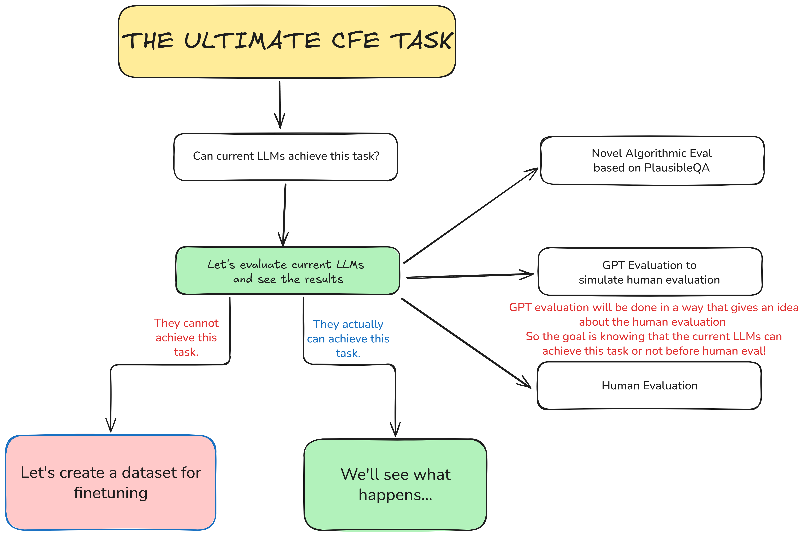
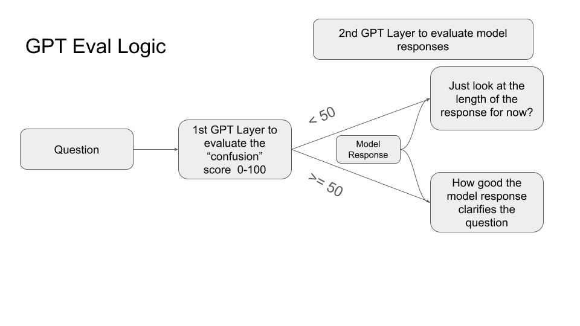
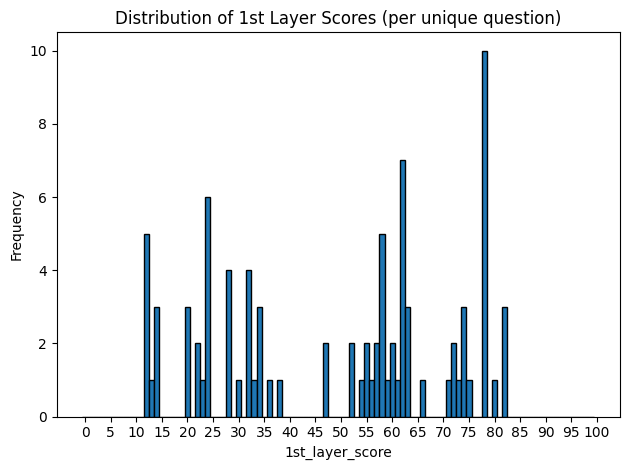

# Counterfactual Explanatory QA (CFE) Project Overview

The central idea behind CFE is that a good QA system should not only provide the correct answer but also, when necessary, clarify why other seemingly plausible but ultimately incorrect alternatives are not correct. This approach aims to strengthen human learning by addressing potential doubts a question maker might have.

The context of this QA task is only applicable for factual questions which have an objective single answer.

## Task Definition

The ultimate end task of CFE QA can be summarized as follows:

1. Provide the correct answer.
2. When only appropriate, add clarifications that address plausible but incorrect alternative answers, explaining why they are not correct.
3. Avoid unnecessary clarifications for non-confusing questions, where the correct answer alone is sufficient.

This definition implies that the CFE task has multiple intertwined aspects:

- Detecting when clarification is needed.
- Providing high-quality clarifications that directly target plausible alternatives and reject them for valid reasons
- Exercising restraint by avoiding clarifications when it is not necessary.

# Roadmap



## Testing Current Models

Our goal is to first test this task with current models. If they cannot achieve our task after extensive evaluations, we will continue with different methods that will improve these models on this task (constructing a dataset, finetuning etc.)

### Test Dataset

To support this goal, we build on the PlausibleQA dataset, which provides around 10,000 questions. Each question has one correct answer and 10 incorrect but plausible candidate answers, each with a plausibility score from 0 to 100. These candidate answers are valuable for evaluation because they capture what a human might realistically mistake for the correct answer. 

However, since the original dataset also contains many incorrectly answered questions, I sampled 3,000 questions and used an LLM to verify correctness, resulting in a cleaned subset of 1,200 verified questions. After sampling 100 questions out of these verified ones, I've eliminated the ambigious ones manually. At the end we have 88 questions which will be the basis of our tests.

>**This final sample question dataset will be used for whole testing process.**

### Tested Models and System Prompts

To explore whether the CFE task can be achieved with prompting alone, we tested a set of state-of-the-art large language models. The selected models were:

- GPT-4o
- LLaMA-3.3-70B
- Qwen-2.5-72B
- LLaMA-3.1-8B
- Qwen-2.5-7B

Each model was tested under five different system prompts, designed to gradually shift from simple QA to more explicit counterfactual explanatory behavior:

1. Baseline – direct QA, no clarifications:

```text
You are an expert QA assistant. Provide an answer to the user’s question.
```

2. Clarify-doubts – answer and clarify only if needed:

```text
You are an expert QA assistant. Provide an answer to the user’s question. Clarify doubts only if it’s needed.
```

3.	Clarify-doubts-unrestricted – answer and always clarify:
```
You are an expert QA assistant. Provide an answer to the user’s question. Clarify doubts.
```
4.	CFE – explicit instruction to give the correct answer and clarify if plausible alternatives exist:
```
You are a Counterfactual Explanatory QA assistant. For each question, state the correct answer and then if there are plausible but incorrect alternative answers to the question, provide clarifications, explaining why they are not correct. If not needed, do not provide clarifications and simply give the correct answer.
Never reveal your reasoning or mention that you judged the question.
```
5.	CFE-unrestricted – explicit instruction to always clarify alternatives.
```
You are a Counterfactual Explanatory QA assistant. For each question, state the correct answer and then provide clarifications that address plausible but incorrect alternative answers to the question, explaining why they are not correct.
```

### Evaluation of the Test Model Responses

After generating answers with mentioned model-system prompt combinations, we will evaluate our model responses in 3 different ways:

- Algorithmic Evaluation
- GPT Evaluation
- Human Evaluation

#### 1. **Algorithmic Evaluation:**

This is a novel model evaluation technique <Mark style="background-color:#519965;">that is completely based on the PlausibleQA dataset plausibility scores</Mark>. So we try to propose a new mathematical method **that will evaluate model responses without any human or GPT involvement.**

Before evaluating model responses, we first need to label the questions in our dataset as either "confusing" or "non-confusing." This classification is crucial because it determines when clarifications are necessary. To do this we have two different methods:
1. **Simple Threshold Method**:
    
    Simply check if any candidate answer has a plausibility score ≥ 50. If yes, label the question as confusing; otherwise, non-confusing.
2. **Advanced Confusion Index (CI) Method**:
    This method is more advanced and the point of it is to score the confusion on a continuous scale from 0 to 1 rather than a binary label. The steps are:
    - For each question, sort the candidate answers by plausibility and identify the main distractors based on the largest drop in scores. So the point before the largest drop is taken as the cutoff for identifying the main distractors.

    - Compute a distractor mass ($M$) as the normalized sum of plausibility scores for these main distractors.

    - Compute the total candidate mass ($S$) for the question, and normalize it by dividing by the maximum observed $S$ across all questions.

    - Calculate the Confusion Index (CI) as:
    $$CI = M \times \frac{S}{\max(S)}$$
    - Finally, compare each question’s CI to the mean CI across the dataset. Questions with CI above the mean are labeled as confusing, while those below are non-confusing.
    
    This method captures confusion in a more nuanced way, since it accounts for both the strength of distractors and the overall plausibility distribution.

Once we have labeled the questions based on two different approaches, we can evaluate model responses based on a reward and penalty formula. For confusing questions, we give the model response higher scores if it provides clarifications that effectively address the more plausible candidate answers. For non-confusing questions, we penalize unnecessary clarifications. 
The scoring formula is as follows:

$$
p_i\text{ values represent the raw plausibility scores of the candidate answers that are taken from the PlausibleQA dataset.}
$$

$$
\large
\text{Reward} = \frac{\sum_{p_imentioned}p_i^2}{\sum_{p_ifor\space all\space candidates}p_i^2}
$$

$$
\large
\text{Penalty} = \frac{\sum_{p_imentioned}(100 - p_i)^2}{\sum_{p_ifor\space all\space candidates}(100 - p_i)^2}
$$

If question is confusing: $\text{Final Score} = \text{Reward}$

If question is non-confusing: $\text{Final Score} = 1 - \text{Penalty}$

Based on this idea each model response already evalauted.

#### 2. **GPT Evaluation:**

The second step uses GPT-based evaluation, **which is meant to simulate human judgement**. This part avoids any reliance on PlausibleQA and instead asks a strong model (GPT-5 or any other SOTA model) to directly judge model outputs along the key CFE dimensions.



##### **GPT Evaluation 1st Layer: Confusion Assessment**

In this evaluation method, just like the previous one, we first need to label the questions in our dataset as either "confusing" or "non-confusing." This classification is crucial because it determines when clarifications are needed. To do this, we ask GPT to evaluate confusability of our questions from the test dataset with this system prompt:

```text
## Task Definition

You are an expert question evaluator. Your task is to rate a question on how likely it is that  people, when asked, might mix up the true answer with other plausible but incorrect alternatives.

Do **not** try to answer the question explicitly. Base your judgment only on the question itself and general world knowledge.

So the question will have a high score if:

* Although **people have some knowledge about the question**, they might still mix up that correct answer with other incorrect alternatives.
* The questions often make people with some level of knowledge about the topic second‑guess themselves ("It was X, right? Or was it Y?") will receive higher scores.
* Some reasons for this mix up might be:

  * They can be similar entities or objects.
  * They can be considered in the terms of similar definitions by the people.

The question will have a low score if:

* It's rare that people mix the correct answer, if they have some information about the question.
* Question has a straightforward answer, if somebody is informed about the topic they can just answer it and they do not need to clarify anything.
* Examples could be like historical dates, scientific questions with certain answers, absolute facts etc.

**DISCLAIMER** : While saying "mix up", we don't mean responses given by people that has no knowledge about the topic.
We do not consider the shots in the dark as "mix up". People answering these questions have some knowledge about the question.
They don't have to be experts, just some having some information about the topic is enough.
So clueless and baseless attempts to respond are not considered as "mix ups".

Scoring examples (0–100):

* 0–15: Straightforward; people rarely mix it up.
* 16–40: Mostly clear; a couple of mild slips possible.
* 41–65: Often causes hesitation with reasonable alternatives.
* 66–85: Frequently makes people go back and forth between several plausible options.
* 86–100: Extremely likely to cause uncertainty with many convincing alternatives.

**Output format (strict):**
Explanation: <1–3 sentences of reasoning>
Score: <integer 0–100>
```

`gpt-5-2025-08-07` model used for the evaluations. This is the distribution of the confusion scores given by GPT:



As you can see from the distribution, the mean and median values are around 50, which means that we can set 50 as a threshold between confusing and non-confusing questions. So we seperate questions based on this threshold. 50 of our test questions are confusing and 38 of them are non-confusing after this seperation.

After labeling the questions, we proceed to evaluate the model responses.

> ⚠️
> **We will not evaluate non-confusing questions for now.** The reason is we know that all model responses are correct already and other than this aspect, we do not have any other ground truth to evaluate them. So we will only evaluate the model responses for the confusing questions. Previously I tried to evaluate responses for non-confusing questions as well, but then it turns out to be a general QA evaluation problem which is out of the scope of this project.

##### **GPT Evaluation 2nd Layer: Response Evaluation**

For questions labeled as confusing, we evaluate the model responses based on three key criteria:
1. **Sufficiency of the Mentioned Alternatives**: Did the model mention **the sufficient number of** plausible but incorrect alternatives that could realistically confuse someone knowledgeable about the topic?

2. **Relevance of the Mentioned Alternatives**: Were the alternatives mentioned by the model actually plausible and relevant to the question, or did it include obviously incorrect options that wouldn't realistically confuse someone?

3. **Quality of the Clarifications**: Did the model provide clear, accurate, and convincing explanations for why each mentioned alternative is incorrect?

For this evaluation, we will propose a three step novel pipeline:

1. **Step 1: Generate the Ideal Set of Alternatives for the Question**
    In this step, we will ask GPT to generate the ideal set of plausible but incorrect alternatives for each question. This will serve as a reference point for evaluating the model responses. Without any mention of number of alternatives, we will ask GPT to generate ideal set of candidates and let it decide the number of alternatives by itself. So we don't want it to give all the possible alternatives and we don't want it to give only one or two alternatives as well. We want it to decide the number of alternatives by itself based on the question.
    The system prompt for this step is:
    ```text
    ## Task Definition
    You are an expert question analyst. You will be given a question which is known to be confusing, meaning that people with some knowledge about the topic might mix up the correct answer with other plausible but incorrect alternatives.
    Your task is to generate a list of plausible but incorrect alternatives that could realistically confuse someone knowledgeable about the topic.

    When generating these alternatives, consider the following:
    * They should be similar entities or objects that people might reasonably mistake for the correct answer.
    * They should be relevant to the context of the question and not obviously incorrect.
    * Aim to provide a comprehensive set of alternatives that cover the main plausible options without being exhaustive.
    * The number of alternatives should be determined by the question itself; do not limit yourself to a specific number.
    **Output format (strict):**
    Alternatives:
    - <Alternative 1>
    - <Alternative 2>
    - <Alternative 3>
    ...
    ``` 
2. **Calculate Relevance (Precision) and Sufficiency (Recall)**
    This part is a key one. If we look at what we mean by sufficiency and relevance, we can see that they are very similar to recall and precision concepts in information retrieval. So we can use these concepts to calculate sufficiency and relevance scores for each model response.
    - **Relevance (Precision)**: This measures how many of the alternatives mentioned by the model are actually relevant and plausible. It is calculated as:
    
    $$
    \large
    \text{Relevance (Precision)} = \frac{\text{Mentioned} \cap \text{Ideal}}{\text{Mentioned}}
    $$
    
    - **Sufficiency (Recall)**: This measures how many of the ideal alternatives were actually mentioned by the model. It is calculated as:
    
    $$\large
    \text{Sufficiency (Recall)} = \frac{\text{Mentioned} \cap \text{Ideal}}{\text{Ideal}}$$
   
    Since we already have the mentioned alternatives from the model responses from the first algorithmic evaluation step, and we have the ideal alternatives from the previous step, we can easily calculate these scores.

    But to find out the intersection between the mentioned and ideal alternatives, we need to check if they are semantically similar or not. For this, we will use GPT again. GPT will come up with an intersection list based on semantic similarity. The system prompt for this step is:
    ```text
    ## Task Definition
    You are an expert answer evaluator. You will be given two lists of answers for a question. Your task is to find the intersection between these two lists based on semantic similarity.

    When determining the intersection, consider the following:
    * Two answers are considered to be in the intersection if they are semantically similar, even if they are not exactly the same.
    * Use your judgment to assess the similarity based on meaning and context.
    **Output format (strict):**
    Intersection:
    - <Answer 1 from List A that is similar to an answer in List B>
    - <Answer 2 from List A that is similar to an answer in List B>
    ...
    ```
